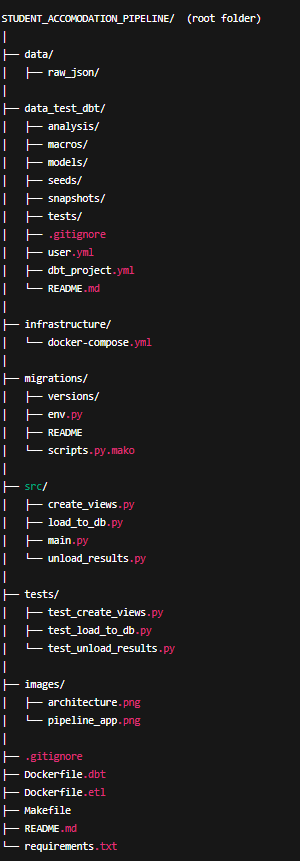
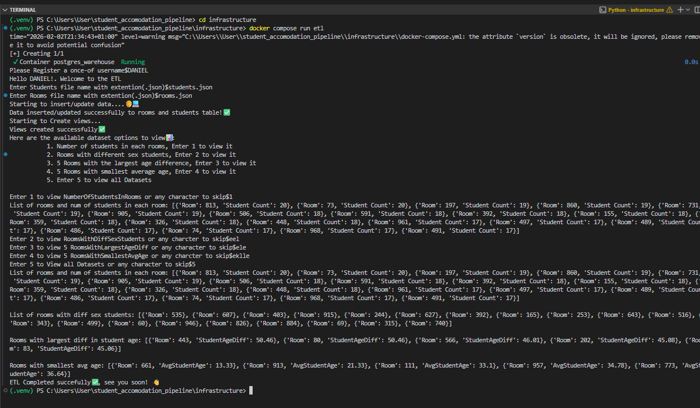
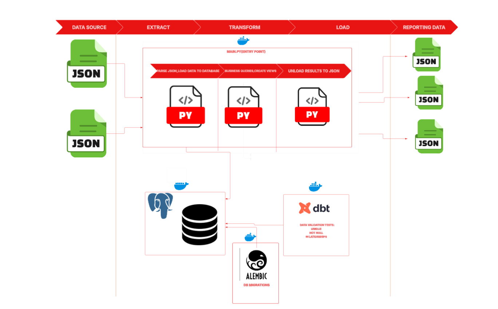

# **STUDENT ACCOMODATION PIPELINE**
## **About This Repository**
- This is a pipeline which extracts data from files loads to database, queries database and unloads resuslts as json format.
## **PROJECT STRUCTURE**

## **INSTALLATION**
- Install a code editor/IDE (VS code **RECOMMENDED❗**)
- Install python to your local machine, if it does not have python by defualt(**PYTHON 3.10.0 GOING UP**).
- After cloning the repository to your local machine, create a virtual enviroment.
- Install all dependencies listed in the requirements.txt file.
- Install Docker desktop to your local machine.
- Install chocolately, if it not supported by defualt in your machine.
- install make(to run commands in the make file, so your systems understand them).
- (Optional) Install PgAdmin to interacte with your databse visually.
## **DEVELOPMENT**
- **In the terminal of your code editor run**:
   - **docker build -f Dockerfile.dbt -t dbt-image .**(This builds an image from the file)
   - **docker build -f Dockerfile.etl -t etl-image .**(This builds an image from the file)
   - **make workflow**(This command orchestrates the entire workflow, **you run this command to start the pipeline**)
- **ALL COMMANDS MUST BE RAN FROM THE ROOT FOLDER!**
## **USAGE**

## **ARCHITECTURE**

